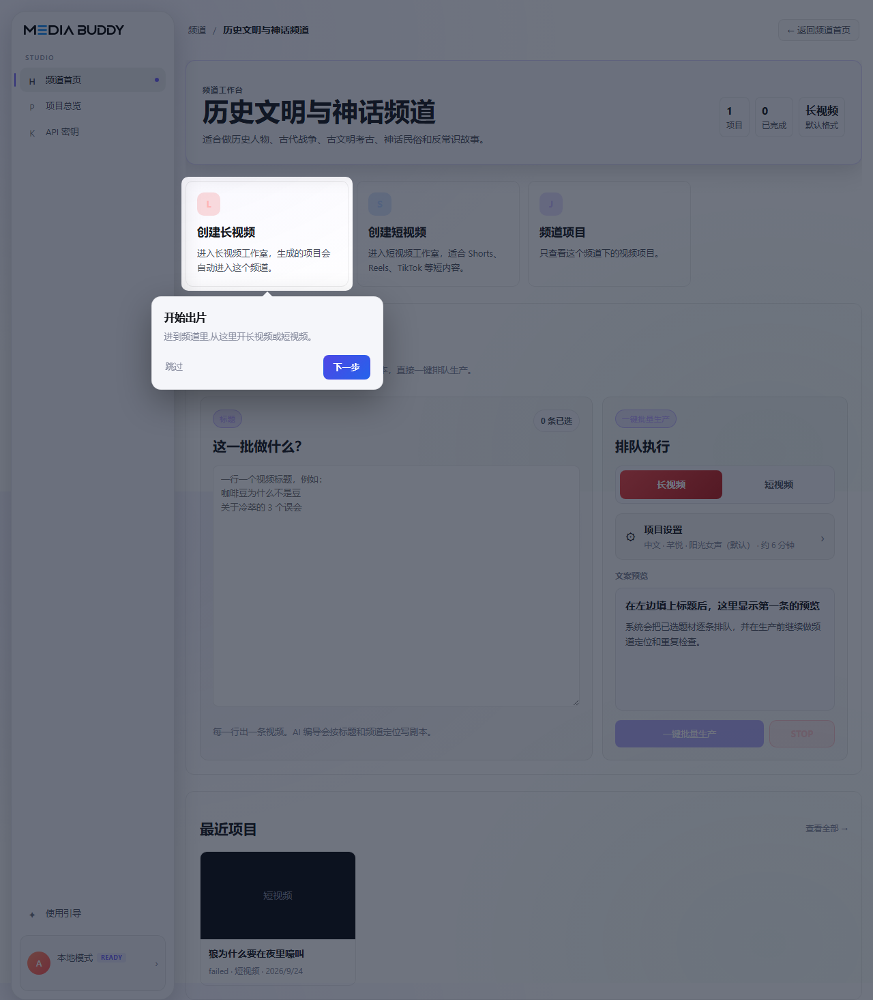
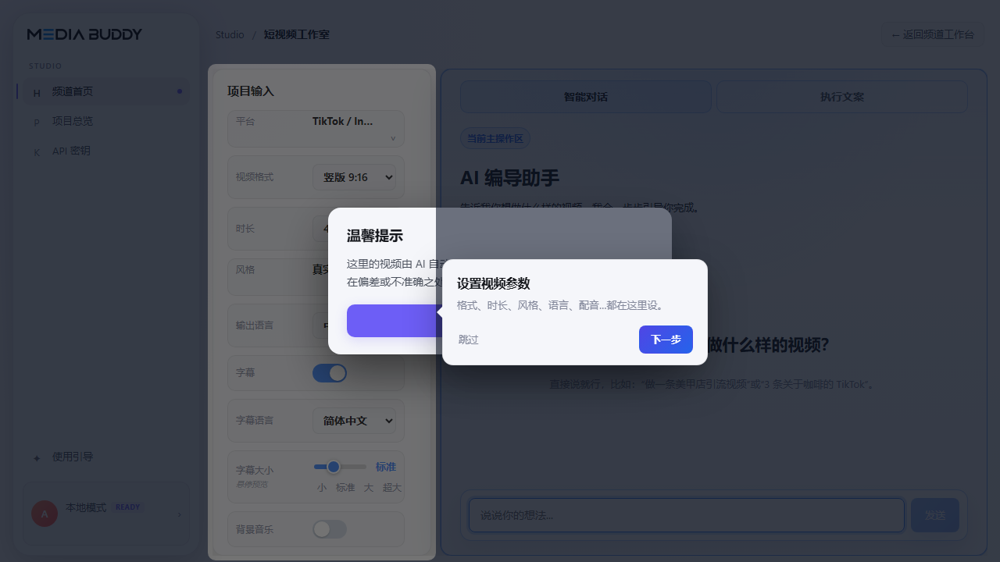
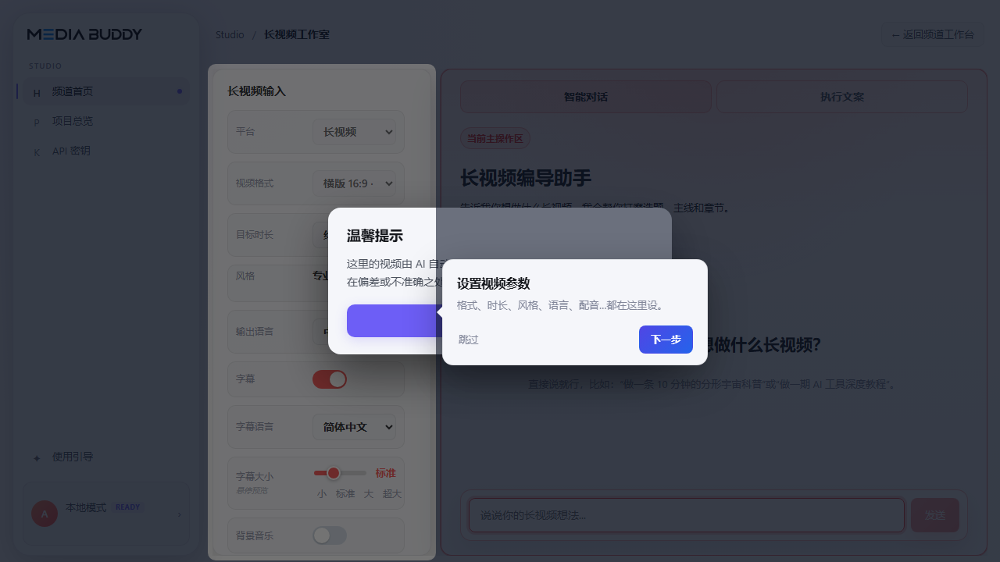
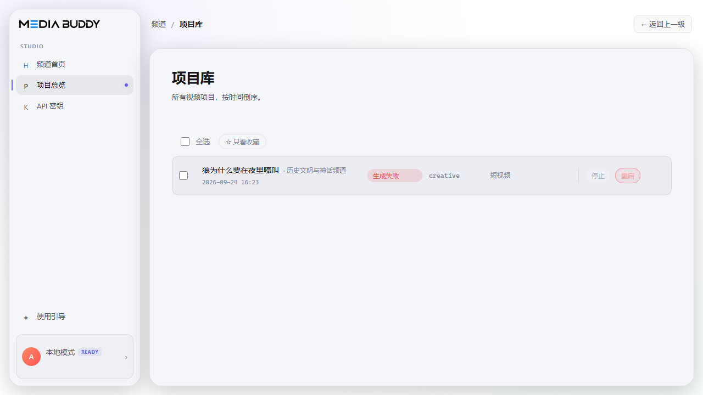

# Media Buddy (source-available, noncommercial)

**Give it a channel and a few titles → get finished short or long videos.** Script by an AI director, stock footage matched shot by shot, voice-over, subtitles, music — rendered locally with ffmpeg, using **your own API keys**.

> 中文说明在下方 → [中文](#中文)

This is the source-available edition of [Media Buddy](https://media-buddy.com), released under the **PolyForm Noncommercial 1.0.0** license: free for personal, educational, research and nonprofit use. **Commercial use of this repository is not permitted.** For business use, use the hosted product at [media-buddy.com](https://media-buddy.com).

## What it does

Media Buddy is a **video factory for talking-head-free explainer content**: knowledge shorts, documentary-style narration, animal / history / science / business channels, "did you know" formats. You do not shoot anything. You give it a channel positioning and a title; it writes, voices, illustrates with stock footage, subtitles, scores and renders a finished MP4 you can upload as-is.

A hosted version with zero setup runs at [media-buddy.com](https://media-buddy.com/?utm_source=github&utm_medium=readme&utm_campaign=oss).



### How one video gets made

| Stage | What happens | What you get |
|---|---|---|
| 1. Script | The AI director researches the topic online, then writes a spoken script in the channel's voice, with the channel rules (positioning, forbidden topics, closure style) enforced. A length model keeps it inside the target duration and a "story lands" check rejects scripts that trail off. | `script.txt` you can read and edit |
| 2. Voice | Text-to-speech with word-level timestamps. Qwen (24 Mandarin voices) with your key, free Microsoft Edge voices without one, ElevenLabs optional. Speed and pacing are calibrated per voice so a 60-second target really comes out near 60 seconds. | `narration.mp3` + word timings |
| 3. Shot plan | The script is split into visual chunks (about one per sentence). For each chunk the director decides what the viewer should see, writes English stock-search queries, and lists what must / must not appear. | `visual_plan.json` |
| 4. Footage | Every chunk searches the free stock libraries (Pexels, Pixabay, Coverr). Candidates are filtered by metadata, then a vision model looks at each thumbnail and accepts or rejects it against the chunk's intent. Repeats are capped so the same clip is not reused across the video. | one clip per chunk, plus a selection trace explaining every pick |
| 5. Subtitles | Sentence-level subtitles from the TTS timings, in the narration language or a second language, with adjustable size. | burned into the video |
| 6. Music + compose | Background music from Pixabay / Freesound, ducked under the voice; clips are trimmed, reframed to 9:16 or 16:9 and cut to the narration with ffmpeg on the CPU. | `final.mp4` |

Everything runs on your machine. The only network calls are to the providers whose keys you pasted.

### Features

- **Channels** — a channel is a content line with a stable personality: positioning text, tone, output language, default voice, default format. Create one from 30+ presets (animals, history, science, business, lifestyle, city guides, …) or describe your own and let the AI write the positioning. Channel rules are applied to every script; a duplicate check warns when a new title overlaps something the channel already made.
- **Batch production** — paste titles, one per line, choose short or long, click once. Each title becomes a project and renders in the background, one after another.
- **Short video studio** — for a single short: pick the platform preset (YouTube Shorts / TikTok / Reels / 抖音 / 快手 / 小红书 / Bilibili / LinkedIn), duration (15–30 s, 30–45 s, 45–60 s), voice, subtitle language; talk to the AI director to shape the angle before you render.
- **Long video studio** — chaptered explainers: 3–5, 5–8, ~10, 12–20 or 20–30 minutes, 16:9. The script is built from an outline (hook → chapters with a contrast backbone → close) and rendered chapter by chapter.
- **Projects** — every render with its stage progress, a preview player, download (single or zip), favourites, and the per-shot selection trace when you want to know why a clip was chosen.
- **Settings → API Keys** — paste keys in the app (stored in your OS keychain) or in `.env`; both take effect without a restart. The page shows which keys are configured, never their values.
- **Three UI languages** — Simplified Chinese, Traditional Chinese, English. Output language per project: Chinese or English.




### How far it goes (honest expectations)

- **Formats:** 9:16 shorts (15–60 s) and 16:9 long form (3–30 min). Square is not offered.
- **Time per video:** a 60-second short typically takes 5–10 minutes end to end on a laptop; long videos scale with length. Script and voice are fast; footage search and the vision checks are where the time goes.
- **Cost per video with your own keys:** around 20–40 LLM calls for a short (mostly small models); usually a few US cents, plus the voice provider if you use one. Stock libraries are free within their rate limits.
- **Footage quality is bounded by the free libraries.** Common subjects (nature, cities, food, hands at work) look good. Narrow subjects (a specific species, a named building, a historical figure) are often thin on Pexels/Pixabay. When no acceptable clip exists for a chunk the render **fails closed** instead of padding with random B-roll, and the project shows which chunk had no match. That is deliberate.
- **Languages:** Chinese-first; English scripts and voices work. Other output languages are not tuned.
- **What it will not do:** suggest topics for you, import or edit your own footage, generate AI video clips, upload to platforms, or run for multiple users.



## Quick start

Requirements: **Python 3.11+**, **Node 20+** (only to build the UI once), **ffmpeg** on your `PATH` (Windows: `scripts/fetch-ffmpeg.ps1`).

```bash
git clone <this repo> media-buddy && cd media-buddy

# 1. backend
python -m venv .venv
# Windows: .venv\Scripts\activate    macOS/Linux: source .venv/bin/activate
pip install -e ".[dev]"

# 2. build the web UI once (served by the backend afterwards)
cd src/frontend && npm install && npm run build && cd ../..

# 3. run
cd src && uvicorn backend.main:app --port 8000
```

Open **http://127.0.0.1:8000**, go to **Settings → API Keys**, paste at least `OPENROUTER_API_KEY` and `PEXELS_API_KEY`, and start a channel. Add `MEDIA_BUDDY_QWEN_API_KEY` for the Qwen Mandarin voices. (Or copy `.env.example` to `.env` in the repo root before starting.)

### Keys

| Key | Required | What for |
|---|---|---|
| `OPENROUTER_API_KEY` | **yes** | every LLM call (script, shot planning, verifier, vision, research) — Qwen, Claude, GPT, Gemini all through one key |
| `PEXELS_API_KEY` | **yes** | free stock footage |
| `MEDIA_BUDDY_QWEN_API_KEY` | recommended | Qwen voice-over only (24 Mandarin voices, the default narrator); without it the free Microsoft Edge voices are used |
| `PIXABAY_API_KEY`, `COVERR_API_KEY`, `FREESOUND_API_KEY` | optional | more free stock / music |
| `MEDIA_BUDDY_ELEVENLABS_API_KEY` | optional | premium English voices (also set `MEDIA_BUDDY_ENABLE_ELEVENLABS=1`) |

Default models: text `anthropic/claude-haiku-4-5`, vision `google/gemini-2.5-flash`, both via OpenRouter. Override with `MEDIA_BUDDY_DEFAULT_MODEL`, `OMNI_MODEL`, or per purpose `MEDIA_BUDDY_<PURPOSE>_MODEL` (see `src/backend/lib/llm_client.py`).

### Using the HTTP API directly

The backend trusts requests from its own origin. From another client, pass the per-install token stored at `~/.media-buddy-oss/.app_token`:

```bash
TOKEN=$(cat ~/.media-buddy-oss/.app_token)
curl -H "X-MediaBuddy-Token: $TOKEN" http://127.0.0.1:8000/api/system/status
```

Interactive docs: `http://127.0.0.1:8000/docs`.

## Development

```bash
pytest                                   # offline
cd src/frontend && npm run typecheck && npm run build
cd src/frontend && npm run dev           # hot-reload UI on :5173 (backend on :8000)
```

Tests never call the network (`MEDIA_BUDDY_ALLOW_OFFLINE=1` is set by `tests/conftest.py`).

## License

**PolyForm Noncommercial 1.0.0** — see [LICENSE](./LICENSE) and [NOTICE](./NOTICE).

- ✅ Personal projects, learning, research, nonprofits, government: use, modify, share freely.
- ❌ Any commercial use (inside a company, as a service, in a paid product): not permitted. There is no commercial license for this repository; businesses use the hosted product at [media-buddy.com](https://media-buddy.com).

Third-party components keep their own licenses: [THIRD_PARTY_LICENSES.md](./THIRD_PARTY_LICENSES.md). "Media Buddy" is a trademark; the hosted service is separate.

---

## 中文

**给一个频道、几行标题 → 直接出短视频或长视频。** AI 编导写剧本，逐句匹配素材，配音、字幕、配乐，本机 ffmpeg 合成，用**你自己的 API key**。

这是 [Media Buddy](https://media-buddy.com) 的源码公开版（**PolyForm Noncommercial 1.0.0**：个人、学习、科研、非营利可自由使用和修改；**本仓库不可商业使用**，商用请用托管版 [media-buddy.com](https://media-buddy.com)）。

### 它是干什么的

Media Buddy 是一台**不用出镜的解说类视频工厂**：知识短视频、纪录片式解说、动物 / 历史 / 科普 / 商业频道、「你知道吗」这类内容。你不用拍任何东西，给它一个频道定位和一个标题，它自己写稿、配音、配画面、上字幕、配乐，合成一条能直接上传的 MP4。

零配置的托管版在 [media-buddy.com](https://media-buddy.com/?utm_source=github&utm_medium=readme&utm_campaign=oss)。

### 一条片子是怎么出来的

| 阶段 | 做了什么 | 你拿到什么 |
|---|---|---|
| 1. 写稿 | AI 编导先上网查资料，再按频道的口吻写口播稿；频道规则（定位、禁区、结尾方式）强制生效。长度模型把稿子压在目标时长内，「故事有没有讲完」的检查会打回虎头蛇尾的稿子。 | 可读可改的 `script.txt` |
| 2. 配音 | 带逐字时间戳的语音合成。有千问 key 用 24 个中文音色，没有就用免费的微软 Edge 音色，ElevenLabs 可选。每个音色都做过语速标定，要 60 秒就基本出 60 秒。 | `narration.mp3` + 字级时间 |
| 3. 分镜 | 稿子按句切成画面段。每段由编导决定观众该看到什么，写英文的素材搜索词，列出必须出现 / 不能出现的东西。 | `visual_plan.json` |
| 4. 取材 | 每段去免费素材库（Pexels、Pixabay、Coverr）搜。先按元数据过滤，再让视觉模型逐张看缩略图，对着这一段的意图判「要 / 不要」。同一条片里同一个素材有复用上限。 | 每段一条素材 + 一份解释「为什么选它」的选片记录 |
| 5. 字幕 | 按配音时间戳出句级字幕，可选跟配音同语言或另一种语言，字号可调。 | 烧进视频 |
| 6. 配乐合成 | 从 Pixabay / Freesound 取背景音乐，人声处自动压低；素材裁剪、重构图到 9:16 或 16:9、按旁白节奏剪，ffmpeg 纯 CPU 合成。 | `final.mp4` |

全部在你自己机器上跑。唯一的对外请求，就是你填了 key 的那几家服务。

### 功能清单

- **频道** —— 一个频道就是一条有固定人设的内容线：定位文案、口吻、输出语言、默认音色、默认格式。可以从 30 多个预设（动物、历史、科普、商业、生活方式、城市……）一键建，也可以自己描述方向让 AI 写定位。频道规则作用于每一篇稿；查重会提醒你新标题和频道里已做过的重了。
- **批量出片** —— 一行一个标题，选长/短，点一下。每个标题变成一个项目，后台一条条排队渲染。
- **短视频工作室** —— 单条精做：选平台预设（YouTube Shorts / TikTok / Reels / 抖音 / 快手 / 小红书 / B 站竖屏 / LinkedIn）、时长（15–30 / 30–45 / 45–60 秒）、音色、字幕语言；出片前先跟 AI 编导聊角度。
- **长视频工作室** —— 带章节的长解说：3–5、5–8、约 10、12–20、20–30 分钟，16:9。稿子从大纲长出来（钩子 → 用「对比」串起来的章节 → 收尾），按章节渲染。
- **项目管理** —— 每条片的阶段进度、预览播放、下载（单条或打包）、收藏；想知道某个镜头为什么选它，有逐镜头的选片记录。
- **设置 → API 密钥** —— 在页面里粘贴（存在系统钥匙串）或写 `.env`，都不用重启。页面只显示「已配 / 未配」，永远不显示值。
- **三种界面语言** —— 简体、繁体、英文。每个项目的输出语言可选中文或英文。

### 能做到什么程度（说实话）

- **格式**：9:16 短视频（15–60 秒）和 16:9 长视频（3–30 分钟）。不提供 1:1。
- **一条片的时间**：笔记本上一条 60 秒短视频通常 5–10 分钟出完；长视频按长度递增。写稿和配音很快，时间主要花在取材和视觉审片上。
- **用自己 key 的花费**：一条短视频大约 20–40 次模型调用（多数是小模型），一般几美分；用了付费配音另算。免费素材库在限额内不要钱。
- **画面质量受限于免费素材库。** 常见题材（自然、城市、美食、手工）效果不错；冷门题材（某种具体动物、某座建筑、某个历史人物）在 Pexels/Pixabay 上经常很薄。**某一段实在找不到合格素材时，它会直接判失败，而不是随便塞空镜糊弄**，项目页会标出是哪一段没找到。这是有意为之。
- **语言**：中文为主，英文稿和英文配音可用；其他语言没调过。
- **这个版本不做的事**：帮你想选题、导入或剪你自己的素材、AI 生成视频片段、一键发布到平台、多用户。

### 三步跑起来

前置：Python 3.11+、Node 20+（只用来 build 一次界面）、ffmpeg 在 `PATH` 里。

1. `pip install -e ".[dev]"`
2. `cd src/frontend && npm install && npm run build && cd ../..`
3. `cd src && uvicorn backend.main:app --port 8000`，浏览器打开 `http://127.0.0.1:8000`

进「设置 → API 密钥」填 `OPENROUTER_API_KEY` 和 `PEXELS_API_KEY`，就能出片（所有大模型调用都走 OpenRouter 一把 key）。想要千问配音再填 `MEDIA_BUDDY_QWEN_API_KEY`，不填用免费的 Edge 音色。
